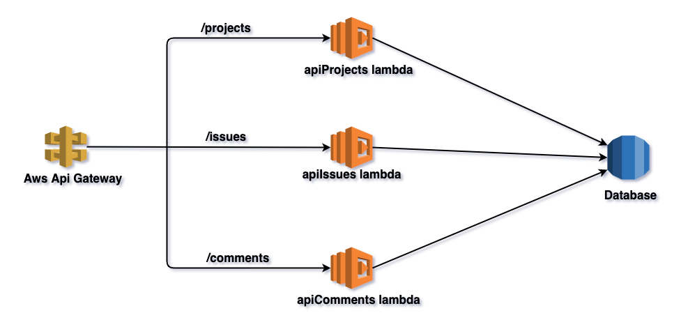
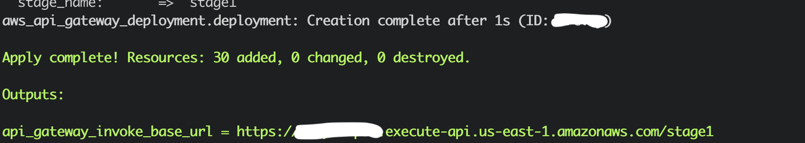

# Architecture for test-data-api

Simple architecture for apis use case. Below the components involved.

## Api Gateway
Component working as interface towards the outer world and functioning as proxy to dispatch request against the lambdas correctly configured behind and attached to it via resources, method and integration

## Lambdas
- apiProjects lambda (Readme can be found [here](docs-images/api-projects/README.md))
- apiComments lambda (Readme can be found [here](docs-images/api-comments/README.md))
- apiIssues lambda (Readme can be found [here](docs-images/api-issues/README.md))

This lambdas are meant to work as REST endpoints serving 3 different entities, respectively [projects](data/README.md##projects), [comments](data/README.md##comments) and [issues](data/README.md##issues)

## Database
Fake database emulated retrieving data from a json file (path: *data/db.json*) having in it the entities mentioned above presented as array of objects


## Architecture diagram
Here a simple diagram to give the idea of the infrastructure:




## Getting started

### Requirements

In order to run this example you need:
- An AWS account (with AWS cli installed and configured)
- Terraform (0.11+)

### Configuration

[Creating IAM users (console)](https://docs.aws.amazon.com/IAM/latest/UserGuide/id_users_create.html#id_users_create_console)

[Terraform configuration](https://registry.terraform.io/providers/hashicorp/aws/latest/docs#authentication)

One approach can be for instance once your aws credentials are created, export this var in your .bash_profile file:

```bash
export AWS_ACCESS_KEY_ID=XXXXXX
export AWS_SECRET_ACCESS_KEY=XXXXXXXXXXXXXXXXXX
export AWS_DEFAULT_REGION=eu-west-1
```

### Deployment
In order to deploy this solution below all the task we can perform via make file:

```bash
make package # create the lambda packages under the folder ./build and respectively `api-projects.zip`, `api-comments.zip`, `api-issues.zip`
```

```bash
make create_bucket # create your create_bucket on aws s3 where to deploy your lambda's artifact code
```

```bash
make deploy_artifacts # deploy the lambda packages against bucket s3://artifact-lamdas
```

```bash
make clean # clean up your build folder
```

```bash
make apply # perform terraform apply so deploying all the infrastructure
```

```bash
make destroy # perform terraform destroy and then remove all the infrastructure
```

## Testing the existing endpoint from cli or browser

After the deployment you will see as output AWS Api Gateway the base invoke url:



```bash
curl https://xxxxxxxxx.execute-api.us-east-1.amazonaws.com/stage1/projects
```

```bash
curl https://xxxxxxxxx.execute-api.us-east-1.amazonaws.com/stage1/projects/1/comments
```

```bash
curl https://xxxxxxxxx.execute-api.us-east-1.amazonaws.com/stage1/comments
```

```bash
curl https://xxxxxxxxx.execute-api.us-east-1.amazonaws.com/stage1/issues
```
